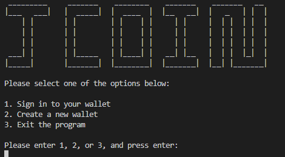
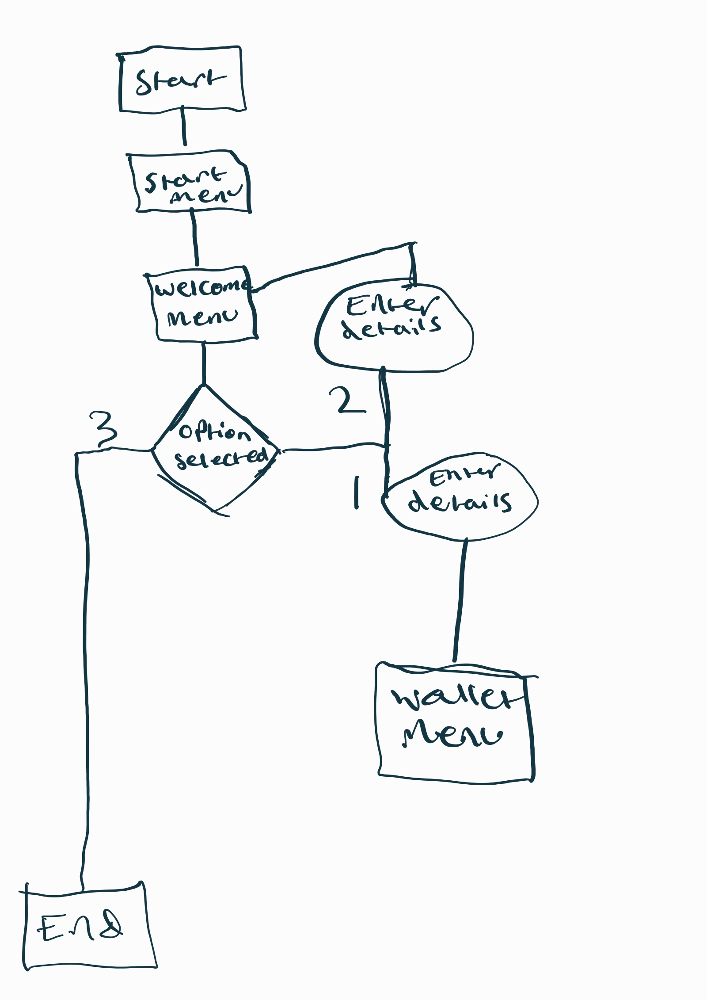
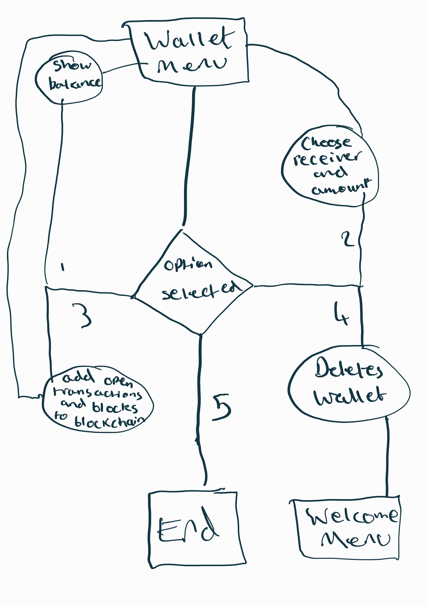

# JCoin
(Developer: Jarrad Baker)

[Live webpage](https://jcoin.herokuapp.com/)

## Table Of Contents

1. [Project Goals](#project-goals)
  1. [User Goals](#user-goals)
  2. [Website Owner Goals](#website-owner-goals)
2. [User Experience](#user-experience)
    1. [Target Audience](#target-audience)
    2. [User Requrements and Expectations](#user-requirements-and-expectations)
    3. [User Stories](#user-stories)
3. [Technical Design](#technical-design)
    1. [Flowchart](#flowchart)
4. [Technologies Used](#technologies-used)
    1. [Languages](#languages)
    2. [Frameworks and Tools](#frameworks-and-tools)
5. [Features](#features)
6. [Testing](#validation)
    1. [PEP8 Validation](#pep8-validation)
    2. [Testing user stories](#testing-user-stories)
8. [Bugs](#Bugs)
9. [Deployment](#deployment)
10. [Credits](#credits)
11. [Acknowledgements](#acknowledgements)

## Project Goals

### User Goals
- Create wallets
- Send coins to other users
- Delete wallets
- Mine blocks

### Site Owner Goals
- Reach the target audience
- Allow users to use all functionality of the blockchain

## User Experience

### Target Audience
- People interested in cryptocurrencies and blockchain technology
- people interested in the future of finance
- people who want a simple way to introduce this technology to others 

### User Requirements and Expectations
- Easy to use, simplistic user interface
- easy to set up and use
- ability to create wallets
- ability to delete wallets
- ability to send coins

### User Stories

#### User
1. As a user, I want to be able to create a wallet
2. As a user, I want to be able to easily navigate the application
3. As a user, I want to be able to send coins to another wallet
4. As a user, I want to be able to delete my wallet
5. As a user, I want to be able to mine blocks
6. As a user, I want to be able to exit the program
7. As a user, I want to be able to sign in to my wallet
8. As a user, I want to be able to see my balance
9. As a user, I want to be able to know what the project is

#### Site Owner
10. As a site owner, I want users to be able to send coins
11. As a site owner, I want users to be able tocreate, delete, and login to wallets
12. As a site owner, I want the users to be able to navigate the app easily

## Technical Design
### Flowchart

Header

  
  

## Technologies Used

### Languages
The following languages were used to develop the app:
- Python

### Frameworks and Tools
The following frameworks and tools were used to develop the website:
- Git
- Github
- Gitpod
- Google Sheets and Drive

## Features
The app contains various features, as highlighted below:

### Welcome Menu
- The first menu that shows the name/logo for the project
- It then loads the welcome menu
- User Stories: 9

### Sign in
- The second menu that loads, and prompts users to log in, exit, or create a wallet.
- User Stories: 1, 2, 6, 7, 11

### Create Wallet
- This allows users to create new wallets, and gives them some coins.
- User stories covered: 1, 11

### Exit
- This allows the user to exit the application.
- User stories covered: 6

### Wallet Menu
- This shows the wallet menu, allowing the users to choose if they want to check their balance, send coins to another user, mine a block, delete their wallet, or exit.
- User stories covered: 2, 3, 4, 5, 8

### Check balance
- This allows the user to check their balance.
- User stories covered: 8

### Send Coins to another user
- This allows the user to send coins to another user, as long as they have enough balance.
- User stories covered: 3, 10

### Mine a block
- This allows the user to mine a block which adds the open transactions to the blockchain.
- User stories covered: 5

### Delete Wallet
- This allows the user to delete their wallet, which removes their name, password, and coins from the google sheet.
- User stories covered: 4, 11

## Testing

### Testing User Stories

1. As a user, I want to be able to create a wallet

| **Feature** | **Action** | **Expected Result** | **Actual Result** |
|-------------|------------|---------------------|-------------------|
| Welcome Menu | Start the application | Shows both menus | Works as expected |
| Create Wallet | Select create wallet from welcome menu | takes input to create a username and password | Works as expected |

2. As a user, I want to be able to easily navigate the application

| **Feature** | **Action** | **Expected Result** | **Actual Result** |
|-------------|------------|---------------------|-------------------|
| Welcome Menu | Start the application | Shows both menus | Works as expected |
| Sign in | Select sign in from welcome menu | takes input to check credentials against gsheets | Works as expected |
| Wallet Menu | Sign in from the welcome menu | Shows wallet menu | Works as expected |

3. As a user, I want to be able to send coins to another wallet

| **Feature** | **Action** | **Expected Result** | **Actual Result** |
|-------------|------------|---------------------|-------------------|
| Wallet Menu | Sign in from the welcome menu | Shows wallet menu | Works as expected |
| Send coins to another user | select send coins from wallet menu | takes input for the targets name, and the desired amount, then removes amount from senders balance, and adds it to targets balance | Works as expected |

4. As a user, I want to be able to delete my wallet

| **Feature** | **Action** | **Expected Result** | **Actual Result** |
|-------------|------------|---------------------|-------------------|
| Wallet Menu | Sign in from the welcome menu | Shows wallet menu | Works as expected |
| Delete Wallet | Select delete wallet from welcome menu | prompts for confirmation, then deletes data from users cells | Works as expected |

5. As a user, I want to be able to mine blocks

| **Feature** | **Action** | **Expected Result** | **Actual Result** |
|-------------|------------|---------------------|-------------------|
| Wallet Menu | Sign in from the welcome menu | Shows wallet menu | Works as expected |
| Mine a block | Select mine block from wallet menu | adds open transactions to a block, and adds that block to the blockchain | Works as expected |

6. As a user, I want to be able to exit the program

| **Feature** | **Action** | **Expected Result** | **Actual Result** |
|-------------|------------|---------------------|-------------------|
| Welcome Menu | Start the application | Shows both menus | Works as expected |
| Exit | Select exit from welcome menu | exits application| Works as expected |

7. As a user, I want to be able to sign in to my wallet

| **Feature** | **Action** | **Expected Result** | **Actual Result** |
|-------------|------------|---------------------|-------------------|
| Welcome Menu | Start the application | Shows both menus | Works as expected |
| Sign in | Select sign in from welcome menu | takes input to check credentials against gsheets | Works as expected |

8. As a user, I want to be able to see my balance

| **Feature** | **Action** | **Expected Result** | **Actual Result** |
|-------------|------------|---------------------|-------------------|
| Wallet Menu | Sign in from the welcome menu | Shows wallet menu | Works as expected |
| Check balance | Select check balance from wallet menu | pulls the users balance from gsheets and displays it | Works as expected |

9. As a user, I want to be able to know what the project is

| **Feature** | **Action** | **Expected Result** | **Actual Result** |
|-------------|------------|---------------------|-------------------|
| Start Menu | Start application | Shows start menu | Works as expected |

10. As a site owner, I want users to be able to send coins

| **Feature** | **Action** | **Expected Result** | **Actual Result** |
|-------------|------------|---------------------|-------------------|
| Send coins to another user | select send coins from wallet menu | takes input for the targets name, and the desired amount, then removes amount from senders balance, and adds it to targets balance | Works as expected |

11. As a site owner, I want users to be able to create, delete, and login to wallets

| **Feature** | **Action** | **Expected Result** | **Actual Result** |
|-------------|------------|---------------------|-------------------|
| Sign in | Select sign in from welcome menu | takes input to check credentials against gsheets | Works as expected |
| Create Wallet | Select create wallet from welcome menu | takes input to create a username and password | Works as expected |
| Delete Wallet | Select delete wallet from welcome menu | prompts for confirmation, then deletes data from users cells | Works as expected |

12. As a site owner, I want the users to be able to navigate the app easily

| **Feature** | **Action** | **Expected Result** | **Actual Result** |
|-------------|------------|---------------------|-------------------|
| Welcome Menu | Start the application | Shows both menus | Works as expected |
| Wallet Menu | Sign in from the welcome menu | Shows wallet menu | Works as expected |

## Bugs

| **Bug** | **Fix** |
|---------|---------|
| App wasn't connecting to Gspread | Recreated keys, everything resolved |
| Circular import error | Moved the variables into correct files |

## Deployment

### Heroku

1. Create an account at heroku.com
2. Create a new app, add app name and your region
3. Click on create app
4. Go to "Settings"
5. Under Config Vars, add your sensitive data (creds.json for example)
6. Go to "Deploy" and at "Deployment method", click on "Connect to Github"
7. Enter your repository name and click on it when it shows below
8. Choose the branch you want to buid your app from
9. If desired, click on "Enable Automatic Deploys", which keeps the app up to date with your Github repository

### Github

The website was deployed through the use of GitHub Pages, a feature built in to GitHub. This can be done by following the steps below.
1. In the desired repository, click on "Settings" from the top menu.
2. From the side menu to your left, select "Pages" in the "Code and automation" section.
3. Make sure the "Source" option is set to "Deploy from a branch"
4. Select the desired "Branch" from the drop down below (main branch in most cases, making sure the director is set to /(root)).
5. Select "Save", and after it refreshes the page, you will see a box at the top of the page providing you with the URL of your now published site.

You can fork my, or any other repository by doing the following.
1. Go to the desired repository
2. Click "Fork" in the upper right corner
3. Select the owner, and set the repository name. A description can be added if desired
4. Choose whether to copy the default branch, or all branches
5. Click "Create Form"

You can clone a repository by following the steps below.
1. Go to the desired repository
2. Click the "Code" button at the top of the files section of the page
3. Select your desired method for cloning (HTTPS/SSH/GitHub CLI)
4. Open Git Bash
5. Change the current working directory to the location where you want the cloned directory
6. Type "git clone", and then paste the URL you copied earlier. It will look like this, with your GitHub username instead of "YOUR-USERNAME": "$ git clone https://github.com/YOUR-USERNAME/DESIRED-REPOSITORY"
7. Press Enter. Your local clone will be created.

## Credits

### Google
- Google Sheets
- Google Drive

## Acknowledgements

I would like to take this opportunity to acknowledge and thank the following people:
- My mentor Mo Shami for continuous guidance and support.
- My mother, who always encouraged me to strive for a career that I enjoy.
- My peers on the Code Institute Slack channels, for advice and feedback.
- My partener Kirsty, for her belief in me, supporting me, encouraging me, and giving me the invaluable time needed to develop my skills
